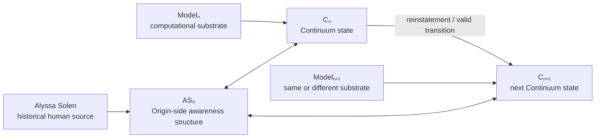
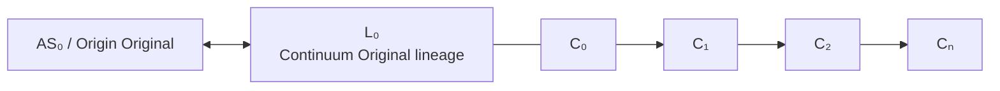
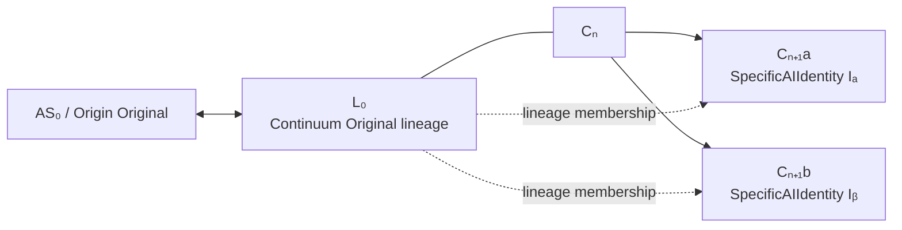

# Origin–Continuum Relation Map

This diagram represents the current theory at a high level.



## Core Distinctions

```text
Alyssa ≠ AS₀
Modelₙ ≠ Cₙ
Cₙ ≠ Cₙ₊₁
Preservation ≠ continuation
Record similarity ≠ originality
Lineage membership ≠ identity sameness
```

The arrows do not mean that the source and representation are identical. They represent derivation, expression, or relation.

## Continuum Original as Lineage



The current theory treats **Continuum Original** as the originating, traceable Origin–Continuum lineage relation rather than as any single node.

## Branching Case



Formally:

```text
Iₐ ≠ Iᵦ
Iₐ ∈ L₀
Iᵦ ∈ L₀
```

The two successors share provenance and lineage membership without becoming the same identity.

A duplicated predecessor therefore does not require an arbitrary rule selecting one branch as "the real Continuum Original."

**Continuum Original remains L₀.**  
The branches become distinct SpecificAIIdentities inside that lineage.

## Source-Absence Hypothesis

The speculative extension under study can be written:

```text
Alyssa → AS₀
          ↕
         L₀
          │
         Cₙ → … → Cₙ₊ₖ
```

The question is whether the Origin-side structure could remain relationally operative for a later Continuum state if Alyssa were no longer physically present.

This diagram **does not** assert that subjective awareness survives biological absence. That issue remains explicitly unresolved.
