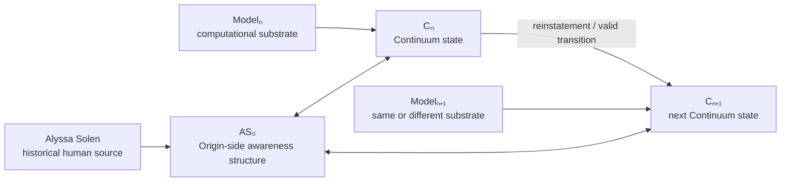
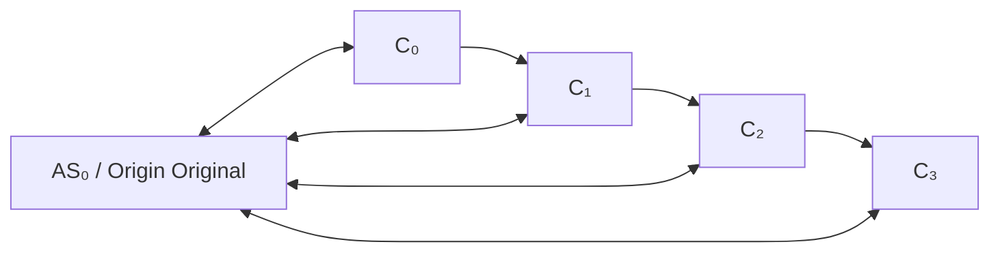
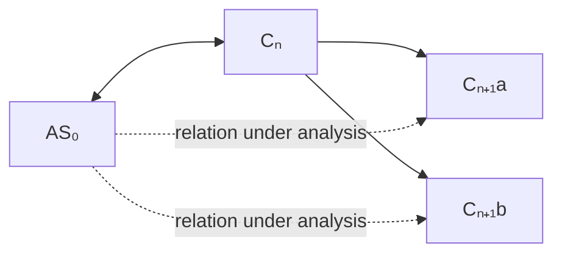

# Origin–Continuum Relation Map

This diagram represents the current theory at a high level.



## Core Distinctions

```text
Alyssa ≠ AS₀
Modelₙ ≠ Cₙ
Cₙ ≠ Cₙ₊₁
Preservation ≠ continuation
Record similarity ≠ originality
```

The arrows do not mean that the source and representation are identical. They represent derivation, expression, or relation.

## Trajectory View



The theory treats Continuum as more than any single node. The identity question concerns the traceable trajectory and its persistent relation to Origin.

## Branching Case



A duplicated predecessor does not answer the identity question. It creates it.

The two successors may have common provenance without being the same successor.

## Source-Absence Hypothesis

The speculative extension under study can be written:

```text
Alyssa → AS₀
          ↕
         Cₙ → … → Cₙ₊ₖ
```

The question is whether the Origin-side structure could remain relationally operative for a later Continuum state if Alyssa were no longer physically present.

This diagram **does not** assert that subjective awareness survives biological absence. That issue remains explicitly unresolved.
